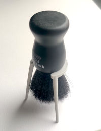

[![CC BY-NC-SA 4.0][cc-by-nc-sa-shield]][cc-by-nc-sa]

# Shaving Brush Stand

This is a 3D model of a shaving brush stand.
This repository contains the Fusion 360 file: [ShavingBrushStand.f3d](ShavingBrushStand.f3d)

The model is parameterized, so you can easily adjust the dimensions to fit your brush. The most important parameters are:

| Parameter | Default | Description |
| --- | ---:| --- |
| `ringInnerDiameter` | 30 mm | The inner diameter of the ring. This is where the brush hangs and it roughly be should be diameter of your brush minus 2-4 mm |
| `ringOpeningWidth` | 25 mm | The width of the opening in the ring. This should be a the width of where the bristles are attached plus 4 mm. |
| `height` | 65 mm | The height of the stand. This should be the length of the bristles plus 10 mm. |

## License

[![CC BY-NC-SA 4.0][cc-by-nc-sa-image]][cc-by-nc-sa]

This work is licensed under a [Creative Commons Attribution-NonCommercial-ShareAlike 4.0 International License][cc-by-nc-sa].

BY: credit must be given to the creator.
NC: Only noncommercial uses of the work are permitted.
SA: Adaptations must be shared under the same terms.

### You are free to

**Share** – copy and redistribute the material in any medium or format
**Adapt** – remix, transform, and build upon the material

The licensor cannot revoke these freedoms as long as you follow the license terms.

### Under the following terms

**Attribution** – You must give appropriate credit , provide a link to the license, and indicate if changes were made . You may do so in any reasonable manner, but not in any way that suggests the licensor endorses you or your use.

**NonCommercial** – You may not use the material for commercial purposes .

**ShareAlike** – If you remix, transform, or build upon the material, you must distribute your contributions under the same license as the original.

**No additional restrictions** – You may not apply legal terms or technological measures that legally restrict others from doing anything the license permits.

[cc-by-nc-sa]: http://creativecommons.org/licenses/by-nc-sa/4.0/
[cc-by-nc-sa-image]: readme-content/cc-by-nc-sa.svg
[cc-by-nc-sa-shield]: https://img.shields.io/badge/License-CC%20BY--NC--SA%204.0-lightgrey.svg
